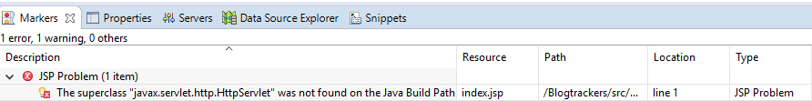

### Project Guide<h1></center>


- __Create a new maven Project of archetype webapps__

 


- __Set the archetype and group id as shown below__

 


- *If you see error “The superclass “javax.servlet.http.HttpServlet”, add this portion to the dependency in pom.xml or Add apache tomcat to Targeted runtime*

 


		<dependency>
			<groupId>javax.servlet</groupId>
			<artifactId>javax.servlet-api</artifactId>
			<version>3.1.0</version>
		</dependency>

- *For MySQL Connector, add this dependency*

         <dependency>
            <groupId>mysql</groupId>
            <artifactId>mysql-connector-java</artifactId>
            <version>5.1.30</version>
         </dependency>


- __Configure your build path using JRE 1.8.0__

 

- __Configure tomcat__

  

  - __To contribute__

   ```
git init
git clone https://github.com/baodium/Blogtrackers-v2.git
git remote add origin git@github.com:User/UserRepo.git
```

 _Get more info about how to clone a repo *here*: [Clone a repo ](https://help.github.com/articles/fork-a-repo/ "Cloning a repo")_
